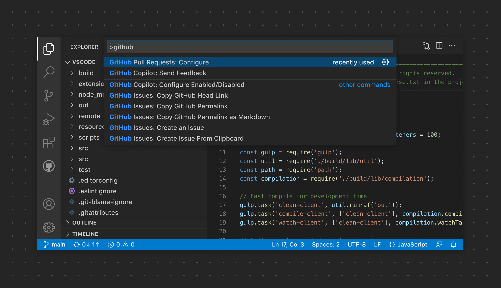

# SE-Assignment-5
Installation and Navigation of Visual Studio Code (VS Code)
 Instructions:
Answer the following questions based on your understanding of the installation and navigation of Visual Studio Code (VS Code). Provide detailed explanations and examples where appropriate.

 Questions:

1. Installation of VS Code:
   - Describe the steps to download and install Visual Studio Code on Windows 11 operating system. Include any prerequisites that might be needed.

the step-by-step process of installing Visual Studio Code on Windows 11, enabling you to start coding with ease.

*Step 1: Download Visual Studio Code Installer:*

1. Open your web browser and navigate to the official Visual Studio Code website: [code.visualstudio.com](https://code.visualstudio.com/).
2. Click on the "Download for Windows" button to download the Visual Studio Code installer.

Step 2: Run Visual Studio Code installer

1. Once the installer is downloaded, locate the downloaded file (typically in your Downloads folder)
2. Double-click on the installer file (e.g., VSCodeSetup-{version}.exe) to run it

Step 3: Install Visual Code

1. In the installer window, you may be prompted to confirm the installation. Click on "Yes" or "Run" to proceed
2. The installer will launch the Visual Studio Code Setup wizard Follow the on-screen instructions to proceed with the installation
3. Review the license agreement and click on "I accept the agreement" to proceed
4. Choose the destination folder where you want to install Visual Studio Code or leave the default location
5. Click on the "Next" button to proceed with the installation
6. Choose any additional tasks you want to perform, such as creating a desktop shortcut or adding VS Code to the PATH environment variable
7. Click on the "Next" button to start the installation process
8. Once the installation is complete, click on the "Finish" button to exit the setup wizard

Step 4: Launch Visual Studio Code

1. After the installation is complete, you can launch Visual Studio Code by double-clicking its icon on the desktop or searching for "Visual Studio Code" in the Start menu
2. Visual Studio Code will launch, and you can start coding right away

2. First-time Setup:
   - After installing VS Code, what initial configurations and settings should be adjusted for an optimal coding environment? Mention any important settings or extensions.

Settings:

- Font and Theme: Set your preferred font and theme by navigating to File > Preferences > Settings. You can search for "font" and "theme" to customize these options

- Indentation: Adjust the tab size and indentation to match your coding style. Search for "tab size" and "indentation" in the settings to modify these preferences

- Auto Save: Enable auto save to ensure that your changes are automatically saved. Search for "auto save" in the settings and choose your preferred option

- Line Numbers: Display line numbers for easier navigation within your code. Search for "line numbers" in the settings and enable this feature.
Extensions: Install essential extensions for your programming language or framework to enhance your coding experience

Extensions:

- Bracket Pair Colorizer: This extension helps to identify matching brackets with colors, making it easier to navigate complex code

- ESLint: If you are working with JavaScript, ESLint can help you identify and fix problems in your code

- Prettier: Prettier is a code formatter that can automatically format your code to maintain a consistent style

- GitLens: GitLens provides valuable insights into your Git repository directly within VS Code, making it easier to understand code authorship and history

- Live Server: For web development, Live Server can launch a development local server with live reload feature for static and dynamic pages

3. User Interface Overview:
   - Explain the main components of the VS Code user interface. Identify and describe the purpose of the Activity Bar, Side Bar, Editor Group, and Status Bar.

Main Components of VS Code User Interface and their purposes

1. Activity Bar: The Activity Bar is located on the far left side of the VS Code window. 
- It provides quick access to these different functionalities, allowing users to switch between them easily

2. Side Bar: The Side Bar is located next to the Activity Bar. 
- It provides access to additional functionalities like debugging, Git integration, and extensions. Users can customize the Side Bar to show or hide specific views based on their preferences

3. Editor Group: The Editor Group is the central area of the VS Code window where files and folders are opened for editing. 
- It consists of one or more editor panes, each displaying a file or a split view of multiple files. Users can navigate between different files and customize the layout of the Editor Group according to their workflow

4. Status Bar: The Status Bar is located at the bottom of the VS Code window. 
- It displays information about the current project, file, and editor. - It also provides access to various features such as language mode selection, indentation settings, line endings, and Git status. 
- It shows notifications and errors, and allows users to change the color theme and toggle various settings

4. Command Palette:
   - What is the Command Palette in VS Code, and how can it be accessed? Provide examples of common tasks that can be performed using the Command Palette.

"The Command Palette is where all Commands are found. It's important that your command names are labeled appropriately so users can easily find them. 

Do's 
- Add keyboard shortcuts where appropriate. 
- Use clear names for commands

Don'ts
- Overwrite existing keyboard shortcuts
- Use emojis in command names

Example: Features commands each displaying a clear category prefix, for example "GitHub Issues"

"

Source: https://code.visualstudio.com/api/ux-guidelines/command-palette#:~:text=The%20Command%20Palette%20is%20where,Use%20clear%20names%20for%20commands

5. Extensions in VS Code:
   - Discuss the role of extensions in VS Code. How can users find, install, and manage extensions? Provide examples of essential extensions for web development.

Role of Extensions in VS Code is to enhance its functionality by adding new features, language support, themes, and more. They allow users to customize their development environment to suit their specific needs.

Users can find, install, and manage extensions in VS Code through the following steps:

1. Finding Extensions: Click on the Extensions view icon in the Activity Bar on the side of the window. Then, use the search bar to find extensions by name or functionality

2. Installing Extensions: Once an extension is found, click the "Install" button to add it to VS Code

3. Managing Extensions: Users can manage their installed extensions by clicking on the Extensions view icon and then selecting the "Manage" gear icon. From there, they can disable, uninstall, or update extensions.

Essential Extensions for Web Development in VS Code include:

1. Live Server: Allows for quick local server setup and live reloading of web pages

2. Prettier - Code formatter: Automatically formats code to ensure consistency and readability

3. ESLint: Provides real-time linting to identify and fix problems in JavaScript code

4. Auto Rename Tag: Automatically renames paired HTML/XML tags

5. Path Intellisense: Autocompletes filenames in your code

6. Integrated Terminal:
   - Describe how to open and use the integrated terminal in VS Code. What are the advantages of using the integrated terminal compared to an external terminal?

To open the integrated terminal in VS Code

- Press Ctrl + ` (backtick) on Windows or Linux, or Cmd + ` on macOS
- Alternatively, you can go to the View menu, then select Terminal

Once the integrated terminal is open, you can use it just like any other terminal. You can run commands, install packages, and manage your project without leaving the VS Code interface.

Advantages of using the integrated terminal compared to an external terminal include:

- Seamless integration: It's conveniently located within the VS Code interface, allowing you to work without switching between different applications

- Workspace awareness: The integrated terminal automatically starts in the root of your workspace, making it easier to run commands specific to your project

- Customization: You can customize the terminal's appearance, behavior, and shortcuts to suit your preferences

- Split panes: You can split the terminal into multiple panes, allowing you to see different outputs at the same time

7. File and Folder Management:
   - Explain how to create, open, and manage files and folders in VS Code. How can users navigate between different files and directories efficiently?

To create files in Vs Code

- Click on the Explorer icon in the Activity Bar on the side of the window
- Right-click on the folder where you want to create the file
- Select "New File" from the context menu and give the file a name

To open an existing file or folder in VS Code:

- Click on the "File" menu at the top of the window
- Select "Open..." and navigate to the file or folder you want to open

To manage files and folders in VS Code

- Rename: Right-click on the file or folder in the Explorer and select "Rename" from the context menu
- Delete: Right-click on the file or folder in the Explorer and select "Delete" from the context menu
- Move: You can drag and drop files and folders within the Explorer to move them to a different location

To navigate between different files and directories efficiently in VS Code

- Switching Between Open Files: Use Ctrl + Tab to cycle through open files
- Go to File: Press Ctrl + P to open the Quick Open menu, then start typing the name of the file you want to open
- Explorer Navigation: Use the Explorer view to navigate between different files and folders by clicking on them

8. Settings and Preferences:
   - Where can users find and customize settings in VS Code? Provide examples of how to change the theme, font size, and keybindings.

To find and customize settings in VS Code

Finding Settings
- To find settings in VS Code, click on the gear icon in the lower-left corner of the window and select "Settings" from the dropdown menu. Alternatively, you can use the shortcut Ctrl + , (Windows/Linux) or Cmd + , (Mac) to open the settings

Customizing Settings
1. Changing the Theme:
- To change the theme, go to the "Color Theme" section in the settings.
Search for "Color Theme" in the search bar, and then select the theme you prefer from the dropdown list.

2. Adjusting Font Size:
To adjust the font size, search for "Font Size" in the search bar.
You can then modify the "Editor: Font Size" setting to your desired value

3. Modifying Keybindings:
- To modify keybindings, search for "Keybindings" in the search bar.
Click on "Edit in settings.json" to customize keybindings using JSON format

Examples:
1. Changing the Theme:
- Go to Settings > Color Theme > Select "Dark+ (default dark)"

2. Adjusting Font Size:
- Search for "Font Size" > Modify "Editor: Font Size" to 16

3. Modifying Keybindings:
- Search for "Keybindings" > Click on "Edit in settings.json" > Add custom keybindings using JSON format

9. Debugging in VS Code:
   - Outline the steps to set up and start debugging a simple program in VS Code. What are some key debugging features available in VS Code?

Setting Up and Starting Debugging in VS Code

1. Install VS Code: Download and install Visual Studio Code from the official website
2. Install Required Extensions: Install any necessary extensions for the programming language of your choice, such as Python, JavaScript, or C++
3. Open Project Folder: Open the folder containing your program in VS Code
4. Create Launch Configuration: Click on the debug icon in the Activity Bar on the side of the window, then click on the gear icon to create a launch.json file. This file contains the configuration settings for debugging
5. Set Breakpoints: Navigate to the file containing your program, and click in the area just to the left of the line numbers to set breakpoints. These are points in your code where the debugger will pause execution
6. Start Debugging: Press F5 or click the green play button in the Debug view to start debugging. This will launch your program in debug mode

Key Debugging Features in VS Code

- Breakpoints: Set breakpoints to pause the program at specific lines of code
- Watch and Variables: View the values of variables and expressions in real-time as you step through the code
- Call Stack: See the path that led to the current point in the code execution
- Step Through Code: Step through the code line by line, or jump to the next breakpoint
- Debug Console: Interact with the program by entering commands and evaluating expressions in the debug console.
- Conditional Breakpoints: Set breakpoints that only trigger when certain conditions are met
- Exception Handling: Catch and handle exceptions that occur during program execution
- Multi-Thread Debugging: Debug multiple threads simultaneously in multi-threaded applications

10. Using Source Control:
    - How can users integrate Git with VS Code for version control? Describe the process of initializing a repository, making commits, and pushing changes to GitHub.

To integrate Git with VS Code for version controls

- Install Git: If Git is not already installed, download and install it from the official website
- Open VS Code: Open the project folder in VS Code where you want to initialize the Git repository
- Initialize Repository: Click on the Source Control icon in the Activity Bar on the side of the window. Then, click "Initialize Repository" to create a new Git repository or select an existing folder to initialize
- Stage and Commit Changes: After making changes to your files, go to the Source Control view, stage the changes by clicking the "+" button next to the file(s) you want to commit, enter a commit message, and press Ctrl+Enter to commit the changes
- Push Changes to GitHub: If you want to push your changes to a GitHub repository, first create a repository on GitHub. Then, in VS Code, click on the ellipsis (...) in the Source Control view and select "Push" to push your committed changes to the GitHub repository

 Submission Guidelines:
- Your answers should be well-structured, concise, and to the point.
- Provide screenshots or step-by-step instructions where applicable.
- Cite any references or sources you use in your answers.
- Submit your completed assignment by 1st July 

